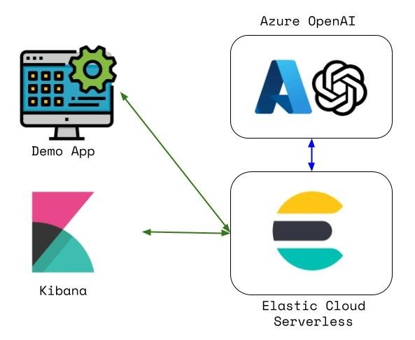

# Elastic Serverless Demo
## Contents
1.  [Summary](#summary)
2.  [Architecture](#architecture)
3.  [Features](#features)
4.  [Prerequisites](#prerequisites)
5.  [Installation](#installation)
6.  [Usage](#usage)

## Summary <a name="summary"></a>
This creates a deployment of Elasticsearch Serverless via API with use of the Elastic Javascript client library for a semantic search scenario.

## Architecture <a name="architecture"></a>
  

## Features <a name="features"></a>
- Builds an Elastic Serverless project via REST API
- Creates a client via the Javascript library
- Performs the following steps with the Javascript client:
    - Creates an Inference Endpoint to an Azure Openai embedding model
    - Creates an index mapping corresponding to a dataset in this repo
    - Bulk loads the included JSON lines dataset (1000 documents).  This Kaggle [dataset](https://www.kaggle.com/datasets/rmisra/news-category-dataset) was used.
    - Performs a sample semantic search against this dataset
- Deletes the Elastic Serverless project


## Prerequisites <a name="prerequisites"></a>
- Elastic Cloud account and API key
- Azure Openai resource and API key
- node
- npm

## Installation <a name="installation"></a>
- Execute the command below
```bash
git clone git@github.com:joeywhelan/serverless-js.git && cd serverless-js && npm install
```
- Rename the .env-template file to .env.  
- Edit that .env file with your Elastic and Azure credentials.

## Usage <a name="usage"></a>
```bash
npm start
```